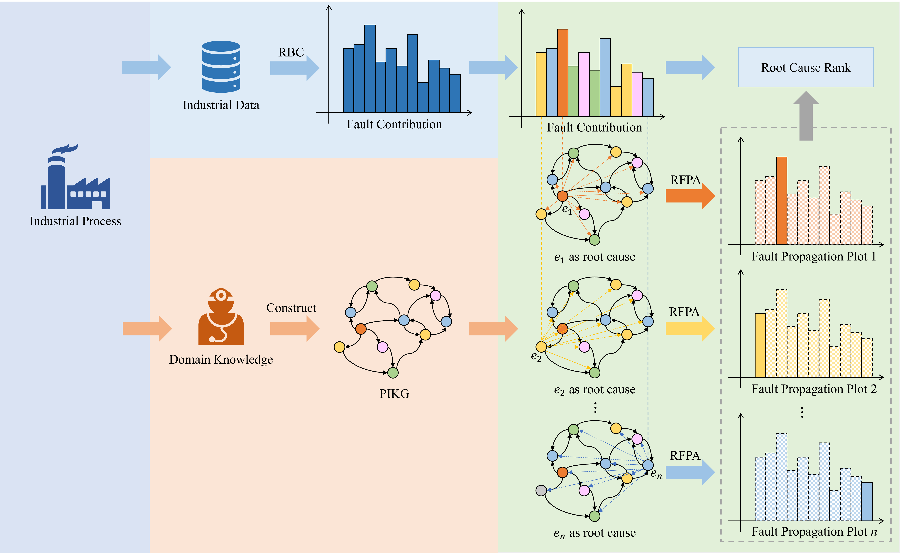
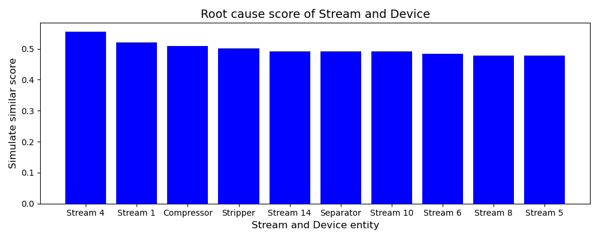
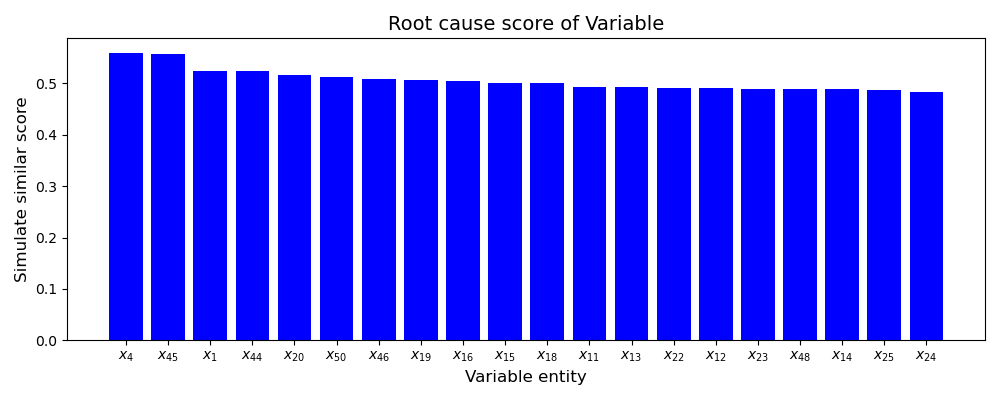

# Root-KGD

我们提供了论文的代码及数据（[Root-KGI: a Novel Framework for Root Cause Diagnosis Based on Knowledge Graph and Industrial Data](https://arxiv.org/abs/2406.13664)）

## 项目背景

1. 考虑到目前全网虽然有很多对TE数据集的简单介绍，但是目前有太多TE数据集相关的工作，相关资源已经超过最初的数据集，而很少有人对此进行系统化介绍，本项目致力于对TE数据集进行详细的、系统化的说明。
2. 目前工业知识图谱没有统一的形式和规范，本项目希望基于TE数据集建立知识图谱。
3. 基于建立的知识图谱，我们设计了一种工业数据和知识图谱联合驱动的故障根因诊断框架

## 项目框架



## 项目目录

```bash
.
├── README.md
├── utils/
    ├── common_function.py                          (通用的函数)
    ├── preprocess_tep_csv.py                       (TEP知识图谱原始数据的预处理)
    ├── knowledge_graph_construction_with_neo4j.py  (Neo4j知识图谱可视化函数)
    └── tep_nmi.py                                  (TEP工业数据集读取与归一化互信息熵(NMI)计算)
├── pca/
    ├── pca_fig.py                                  (PCA故障检测方法与贡献图的故障诊断方法效果图)
    ├── pca.py                                      (PCA故障检测方法与贡献图的故障诊断方法代码)
    └── pca.ipynb                                   (PCA故障检测方法与贡献图的故障诊断方法代码)
├── data_tep/
    ├── common-data/                                (先验的知识or用来展示的数据，程序中不会调用)
        ├── neo4j_syntax.md                         (neo4j会用到的一些语法)
        ├── reference.txt                           (TEP知识图谱参考版本/非建图数据)
        ├── TEP-FIG.pptx                            (TEP流程图)
        ├── dynamic graph.png                       (先验知识和时序知识构建的动态知识图谱可视化结果)
        ├── static graph.png                        (先验知识构建的知识图谱可视化结果)
        └── TEP.jpg                                 (TEP流程图)
    ├── TEP-dataset/                                (TEP工业数据集-时序数据)
    ├── TEP-Introducion.xlsx                        (TEP变量的介绍)
    ├── TEP-Introducion.csv                         (TEP变量的介绍)
    ├── TEP-KG-raw.xlsx                             (TEP图谱原始数据)
    ├── TEP-KG-raw.csv                              (TEP图谱原始数据)
    └── triples.csv                                 (TEP知识图谱处理版)
├── data_mff/                                       (MFF相关数据)
├── fig/                                            (算法结果保存位置)
└── main.ipynb                                      (主函数)
```

## 项目可视化
#### TEP先验知识构建的知识图谱

<p align="center">
    
</p>


## 项目结果示例

TEP故障1结果示例





